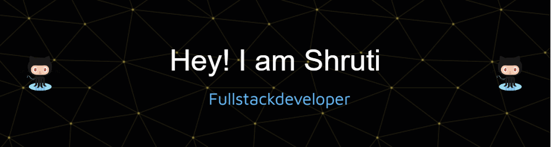

<h1 align="center"  ">Hi 👋, I'm Shruti</h1>
<h3 align="center">A passionate and Curious Full Stack Web developer</h3>

  

- 🌱 I’m currently a **Final Year Undergraduate looking for amazing work opportunities!**

- 💬 Ask me about **Data Structures & Algorithms , Full stack Development**

- 📫 How to reach me **shruti.biradar818@gmail.com**

<h2 align="left"> 🌐 Connect with me:</h2>

## 💻 Tech Stack:
                                

&nbsp;

